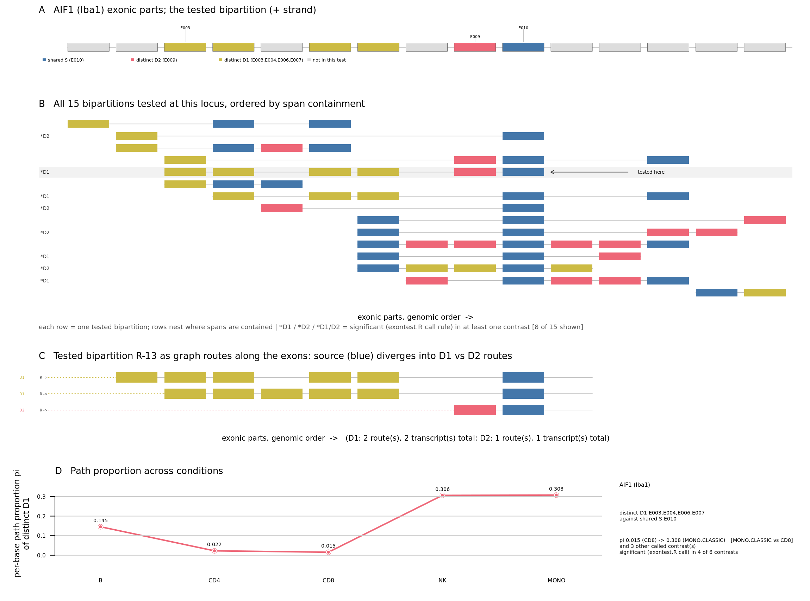
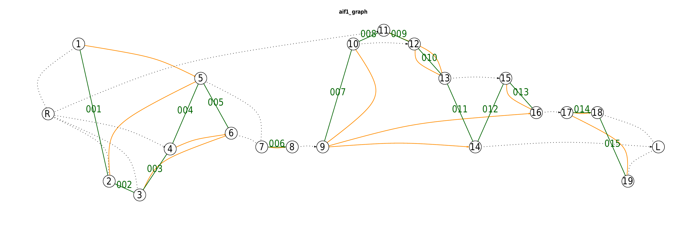
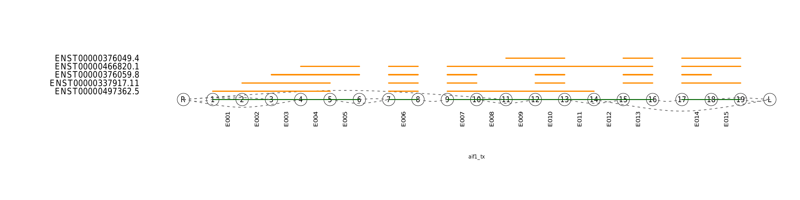

# GrASE
Graph of Alternative Splice junctions and Exonic parts

> **Note:** If you are looking for the source code for the paper [A novel splicing graph allows a direct comparison between exon-based and splice junction-based approaches to alternative splicing detection](https://academic.oup.com/bib/article/26/3/bbaf204/8127326), please check the [`archive/v1-archive` branch](https://github.com/HanLabUNLV/GrASE/tree/archive/v1-archive) or the [`v1.0` tag](https://github.com/HanLabUNLV/GrASE/releases/tag/v1.0).

## About
GrASE (**Gr**aph of **A**lternative **S**plice Junctions and **E**xonic Parts) is a graph-based framework for detecting differential alternative splicing between two conditions from RNA-seq data.

**Core idea.** GrASE represents each gene as a directed acyclic graph (DAG) in which nodes are exonic parts and edges are splice junctions. Within this graph it identifies *bubbles*  -  subgraphs with a shared source and a shared sink  -  each of which corresponds to a region of alternative splicing. This formulation naturally captures events where more than two transcript paths compete inside a single bubble, which simpler binary-focused tools miss.

**What it does that other tools do not.** Instead of classifying splicing into fixed event types (SE, A3SS, etc.), GrASE tests all bubbles it can enumerate in the annotation, examining substantially more events than prior tools while remaining tractable and interpretable. For each bubble it quantifies differential usage as the fraction of reads mapping to the exonic parts that *distinguish* the competing paths (the "distinct" parts) relative to distinct + shared parts.

**Comparison structure.** Each bubble is split by **lower-set bipartition**: the
transcript paths are divided into two groups chosen so that each side has a
well-defined distinct set of exonic parts, analogous to PSI-based tests but
without a fixed event taxonomy. This is the recommended and supported scheme,
and the one behind every reported result.

**Filtering by event class.** Bubbles touching the leftmost graph node (L representing the Transcription Start Site) and the rightmost graph node (R representing the Transcription Termination Site) are classified as alternative TSS/TTS events; all others are internal alternative splicing events. Both categories are tested independently.

**Statistical models.** Differential path usage is tested with a beta-binomial model (via glmmTMB), with the per-test overdispersion (phi) regularised by Empirical Bayes shrinkage. Two variants are recommended and differ only in how the moderated phi is obtained: `betabinom_EBapprox` (closed form) and `betabinom_EBmap` (MAP).

**Workflow.** The pipeline goes from per-gene splicing graphs (GraphML) -> bubble enumeration -> event-type filtering -> DEXSeq count aggregation -> optional junction substitution where a distinct set is empty -> statistical testing. The DEXSeq helper scripts for preparing the annotation and counting reads are bundled, so the only external input is aligned BAM files. Results can be compared against rMATS or DEXSeq output.

* Container used for running GrASE can be found here: [GrASE Container](https://drive.google.com/drive/folders/10H6NxN0T1cP0O68VwhCh55KVVb08Iqzb)

## Dependencies
Tested on Ubuntu (20.04.6 LTS)

R packages:
* SplicingGraphs (1.40.0)
* txdbmaker (1.0.1)
* igraph (1.5.1)
* GenomicFeatures (1.52.0)
* AnnotationDbi (1.62.2)
* DEXSeq (1.46.0)
* glmmTMB
* optparse
* tidyverse

Python packages (only for the bundled DEXSeq helpers):
* python3 (3.11.5)
* htseq   (0.13.5)

Optional:
* STAR  (2.7.10b)  alignment, and the `SJ.out.tab` files Stage 3b reads
* rMATS (4.1.1)    only for the rMATS comparison scripts

## Installation

```bash
git clone https://github.com/HanLabUNLV/GrASE.git
cd GrASE
R CMD INSTALL Rpkg
```

Install the R and Python dependencies listed above first.

The pipeline scripts are run from the clone (`Rpkg/scripts/`); the installed
package provides the library that those scripts load, plus the bundled DEXSeq
helpers. The commands below are written to run from the clone root.

## Quick Start

The full workflow is documented in the package vignette (`vignette("grase-workflow", package = "grase")`). This section gives a concise end-to-end example using the recommended bipartition split and `betabinom_EBapprox` model.

### Already have graphs and splits?

Stages 0 to 2 depend only on the annotation, not on your samples, so they are
done once per annotation version. For human GENCODE v28 and v34 you do not need
to run them at all: the splicing graphs, bipartitions, per-gene GTFs and DEXSeq
GFFs are deposited at
[doi:10.5281/zenodo.23141907](https://doi.org/10.5281/zenodo.23141907).

| File | Contents |
|------|----------|
| `graphml.v28.tgz`, `graphml.v34.tgz` | per-gene splicing graphs |
| `bipartitions_gencode_v{28,34}_{internal,TSSTTS}.tsv.gz` | the enumerated bipartitions |
| `dexseq.gff` | flattened exonic-part annotation, per version |
| `gtf` | per-gene GTFs, per version |

If you already have `graphml/` and the split files under
`bipartition.filtered/`, whether you built them or downloaded them, the only
thing still needed before testing is **exon quantification against the same
DEXSeq GFF the graphs were built from**. Counts made against a different
annotation will not join: the exonic part numbers (`E001`, `E002`, ...) are assigned by
`dexseq_prepare_annotation.py` and are meaningful only relative to that GFF.

```bash
# Resolve the bundled counter.
DEXSEQ_COUNT=$(Rscript -e 'cat(system.file("python","dexseq_count.py",package="grase"))')

# Count every sample against the SAME GFF used to build the graphs.
for cond in group1 group2; do
    mkdir -p ${WD}/DEXSeq/count_files/${cond}
    for bam in ${WD}/bam/${cond}/*.bam; do
        s=$(basename "${bam%.bam}")
        python $DEXSEQ_COUNT --format bam --order pos \
            --paired yes --stranded reverse -a 10 \
            ${WD}/ref/gencode.dexseq.bygene.gff "$bam" \
            ${WD}/DEXSeq/count_files/${cond}/${s}_counts.txt
    done
done
```

Then go straight to Stage 3. Two checks before you do:

- A count file and the GFF should agree on the number of bins for a gene.
  `grep -c "^ENSG00000000003" <sample>_counts.txt` against the `exonic_part`
  lines for that gene in the GFF. A mismatch means the annotations differ.
- Condition subdirectory names must match what you pass to `--cond1`/`--cond2`
  or `--conditions`; `exoncnt.R` finds samples by those directory names.

Starting instead from BAMs and an annotation, begin at Stage 0.

### Stage 0. Prepare input files

GrASE starts from **coordinate-sorted BAM files**, one per sample, under
`${WD}/bam/<condition>/`. Align however you prefer; the published results used
two-pass STAR, and the alignment drivers are in the
[GrASE_simulation](https://github.com/HanLabUNLV/GrASE_simulation) repository
(`STAR/`). If you plan to run Stage 3b, keep STAR's `SJ.out.tab` files too.

Split the genome GTF by gene, build per-gene DEXSeq GFF files, count reads, and
generate the splicing graphs:

```bash
WD=~/GrASE_simulation
mkdir -p ${WD}/{ref,gtf,dexseq.gff,graphml}

# Split full GTF into per-gene files
awk -v outdir="${WD}/gtf" '{
    if (match($0, /gene_id "[^"]+"/)) {
        id = substr($0, RSTART+9, RLENGTH-10);
        print >> outdir "/" id ".gtf"
    }
}' ${WD}/ref/gencode.annotation.gtf

# Gene list: one Ensembl ID per line, read by generate_graphs.R
ls ${WD}/gtf | sed 's/\.gtf$//' > ${WD}/ref/genelist

# Both DEXSeq helper scripts ship with grase; resolve them once.
DEXSEQ_PREP=$(Rscript -e 'cat(system.file("python","dexseq_prepare_annotation.py",package="grase"))')
DEXSEQ_COUNT=$(Rscript -e 'cat(system.file("python","dexseq_count.py",package="grase"))')

# Build per-gene DEXSeq GFF files
cat ${WD}/ref/genelist | \
    parallel -j 8 -I {} "python $DEXSEQ_PREP \
        ${WD}/gtf/{}.gtf ${WD}/dexseq.gff/{}.dexseq.gff"

# Concatenate them into the single GFF the counter reads. Build it this way,
# NOT by running dexseq_prepare_annotation.py on the whole genome GTF: a
# genome-wide run merges overlapping genes into ENSG1+ENSG2 groups and
# renumbers their parts, so the counts would no longer join to the graphs.
cat ${WD}/dexseq.gff/*.dexseq.gff > ${WD}/ref/gencode.dexseq.bygene.gff

# Count reads on exonic parts, one file per sample, grouped by condition.
# Flags are protocol-specific and fail silently if wrong: --paired no for
# single-end, --stranded reverse for dUTP (TruSeq Stranded). See the vignette.
for cond in group1 group2; do
    mkdir -p ${WD}/DEXSeq/count_files/${cond}
    for bam in ${WD}/bam/${cond}/*.bam; do
        s=$(basename "${bam%.bam}")
        python $DEXSEQ_COUNT --format bam --order pos \
            --paired yes --stranded reverse -a 10 \
            ${WD}/ref/gencode.dexseq.bygene.gff "$bam" \
            ${WD}/DEXSeq/count_files/${cond}/${s}_counts.txt
    done
done

# Build igraph splicing graphs from GTF + DEXSeq GFF
Rscript Rpkg/scripts/generate_graphs.R --indir ${WD}
```

Expected input layout:

```
~/GrASE_simulation/
|-- ref/genelist  gene IDs to build graphs for (one per line)
|-- gtf/          ENSG*.gtf          (one per gene)
|-- dexseq.gff/   ENSG*.dexseq.gff
|-- graphml/      ENSG*.graphml      (produced by generate_graphs.R)
`-- DEXSeq/count_files/
    |-- group1/   sample*_counts.txt
    `-- group2/   sample*_counts.txt
```

### Stage 1. Enumerate alternative path splits

```bash
Rscript Rpkg/scripts/bubble_path_split.R \
    --graphdir=${WD}/graphml \
    --outdir=${WD}/bipartition \
    --split=bipartition
```

`--split` also accepts `multinomial` and `n_choose_2`. Those exist only to reproduce the benchmark that selected bipartition; they are not alternatives to choose between for an analysis.

### Stage 2. Separate internal AS events from alternative TSS/TTS

```bash
Rscript Rpkg/scripts/filterTSSTTS.R \
    --split_dir=${WD}/bipartition \
    --outdir=${WD}/bipartition.filtered \
    --split_type=bipartition
```

### Stage 3. Aggregate DEXSeq read counts onto split exonic parts

```bash
Rscript Rpkg/scripts/exoncnt.R \
    -c ${WD}/DEXSeq/count_files \
    -t bipartition \
    --cond1=group1 --cond2=group2 \
    -a internal \
    -i ${WD}/bipartition.filtered \
    -o ${WD}/bipartition.internal.counts
```

This also writes the combined master file `bipartition.internal.exoncnt.combined.txt` into the output directory, which Stage 4 reads. For TSS/TTS events use `-a TSS` (output `bipartition.TSSTTS.exoncnt.combined.txt`). For more than two groups, pass `--conditions=A,B,C` instead of `--cond1/--cond2`.

### Stage 3b. Substitute junction counts where a distinct set is empty (optional)

Some bipartitions have no exonic part exclusive to one side, so that side cannot
be tested on exonic coverage. For those sides only, the distinct set becomes the
intron edges exclusive to that side, counted from STAR split reads; the shared
reference is never changed. In the published run this applied to 28.5% of tests.

```bash
Rscript Rpkg/scripts/bipartition_sjcnt.R \
    --inputdir   ${WD}/bipartition.filtered \
    --graphmldir ${WD}/graphml \
    --gff        ${WD}/ref/gencode.dexseq.bygene.gff \
    --sjdir      ${WD}/STAR \
    --cond1 group1 --cond2 group2 \
    --output     ${WD}/sjcnt \
    --type       internal

Rscript Rpkg/scripts/merge_exon_sj_counts.R \
    --exon_counts ${WD}/bipartition.internal.counts \
    --sj_counts   ${WD}/sjcnt \
    --output      ${WD}/bipartition.merged.counts
```

`--sjdir` holds STAR `SJ.out.tab` files. Run the counting once per event type;
`--type internal` and `--type TSSTTS` write per-gene files with the same name, so
they need separate `--output` directories. If you use this, point Stage 4 at the
merged directory instead of the exonic one.

### Stage 4. Test for differential exon usage

```bash
Rscript Rpkg/scripts/exontest.R \
    --file=bipartition.internal.exoncnt.combined.txt \
    --outdir=${WD}/bipartition.test \
    --countdir=${WD}/bipartition.internal.counts/ \
    --gff_dir=${WD}/dexseq.gff \
    --splittype=bipartition \
    --phi=phi.internal.txt \
    --model=betabinom_EBapprox \
    --use_phi_loess \
    --cond1=group1 --cond2=group2
```

`--phi` names a file inside `--outdir`. If it does not exist, phi is estimated and written there; if it does, it is reused, so use a fresh name (or outdir) whenever the counts change. `--gff_dir` is optional and adds length-normalized (per-base) pi columns to the annotated output.

Recommended models:

| Model | Description | Dispersion input |
|---|---|---|
| `betabinom_EBapprox` | closed-form EB shrinkage of log(phi); behind the published results | `--phi` |
| `betabinom_EBmap` | MAP estimate of phi under a normal prior; the package default | `--phi` |

Benchmark-only, not recommended for an analysis: `betabinom_MLE` (no shrinkage,
null false positives inflate several-fold), `wilcoxon` (most conservative on
null genes, no effect-size estimate) and `dirmult_EBplugin` (for the
benchmark-only multinomial split).

Commonly used options (defaults in brackets): `--padj_threshold` [0.01], `--min_dpi` [0.1], `--min_reads` [10], `--padj_method` [nested_BH], `--mc_cores` [min(detectCores(), 8)], `--contrasts=B:A,C:A` for several pairwise contrasts (or `A+B+C` for an omnibus test, betabinom models only). Independent filtering is on by default; `--no_independent_filtering` turns it off. Run `Rscript Rpkg/scripts/exontest.R --help` for the full list.

### Reading results

```r
results <- read.table(
    "~/GrASE_simulation/bipartition.test/test_bipartition.internal_betabinom_EBapprox.annotated.txt",
    header = TRUE, sep = "\t"
)
sig <- results[results$significant %in% TRUE, ]
head(sig[, c("gene", "event", "source", "sink", "p.value", "padj", "delta_pi", "setdiff1", "setdiff2")])
```

Output files are named `test_{prefix}_{model}.txt`, with `.annotated.txt`, `.mincomb.annotated.txt` (one row per event, min-p across sides) and `.fisher_combined.annotated.txt` variants; `{prefix}` is the first two dot-fields of `--file` (e.g. `bipartition.internal`).

Key output columns: `gene`, `event` (bubble number within the gene), `source`/`sink` (bubble boundary nodes), `contrast`, `p.value`, `padj`, `delta_pi` (change in path proportion), `significant` (padj below `--padj_threshold`, `|delta_pi|` at least `--min_dpi`, and at least `--min_reads` reads in one group), `setdiff1`/`setdiff2` (exonic parts distinguishing each path), `ref_ex_part` (shared reference parts).

### Visualising results

Three entry points, all reading files GrASE already produced.

**One bipartition in detail.** The four-panel case-study figure: the gene model
with each exonic part coloured by its role, every bipartition tested at the
locus ordered by span containment, the tested bipartition as graph routes, and
the path proportion across conditions.

```bash
Rscript Rpkg/scripts/plot_test_results.R \
    --gene ENSG00000204472 --event 11 --kind TSSTTS \
    --analysis ${WD}/bipartition.test \
    --gffdir ${WD}/dexseq.gff --bipdir ${WD}/bipartition.filtered \
    --graphmldir ${WD}/graphml \
    --conditions group1,group2 \
    --symbol AIF1 --out figs/AIF1_ev11.pdf
```

It applies no thresholds of its own; it reads the `significant` column
`exontest.R` wrote, so the figure and the tables cannot disagree. `--out` picks
the format from the extension, so `.pdf`, `.png` and `.eps` all work. Add
`--sjcounts` when a side is junction-sourced, so its junctions are drawn as
arcs, and `--max_stack N` to cap a dense locus.



**A** is the gene model, each exonic part coloured by its role in the tested
bipartition: blue for the shared reference S, yellow and red for the two distinct
sets. **B** is every bipartition tested at this locus, one row each, ordered by
span containment so nesting reads as intervals inside intervals; the grey row is
the one being shown and a star marks each bipartition called in at least one
contrast, labelled by which distinct set drove it. **C** redraws the tested
bipartition as routes through the graph, with R and L marking a route that reaches
the transcript start or end. **D** plots the path proportion across conditions,
length-normalized by default.

**The splicing graph and the transcript structure**, via two exported functions:

```r
library(grase); library(igraph); library(SplicingGraphs)
gene <- "ENSG00000204472.13"

g <- igraph::read_graph(file.path("graphml", paste0(gene, ".graphml")), format = "graphml")
style_and_plot(g, gene, "figs")                      # writes figs/<gene>.pdf

gr   <- rtracklayer::import(file.path("gtf", paste0(gene, ".gtf")))
gr   <- gr[!(rtracklayer::mcols(gr)$type %in% c("start_codon", "stop_codon"))]
sg   <- SplicingGraphs::SplicingGraphs(txdbmaker::makeTxDbFromGRanges(gr), min.ntx = 1)
plottx(gene, "figs", as.data.frame(SplicingGraphs::sgedges(sg[gene])),
       SplicingGraphs::sgnodes(sg[gene]), g = g)     # writes figs/<gene>.tx.pdf
```





Both take `node_range = c(n_min, n_max)` to crop to a window of `sg_id` values,
for showing one region of a large gene rather than the whole locus.

**For publication**, keep PDF as the master and derive the rest. EPS has no
transparency and R's `postscript()` device cannot produce alpha at all, so
drawing EPS directly loses shading in dense scatter plots; converting from PDF
flattens it instead.

```bash
pdftops    -eps fig.pdf fig.eps                  # journal
pdftocairo -svg fig.pdf fig.svg                  # Word and PowerPoint, vector
pdftocairo -png -r 600 -singlefile fig.pdf fig   # raster fallback
```

PowerPoint cannot import EPS, and Word on macOS rasterizes an inserted PDF. Use
the SVG for both.

See the vignette for the full option reference, TSS/TTS events, worked figure examples, and comparison with rMATS/Saturn.
