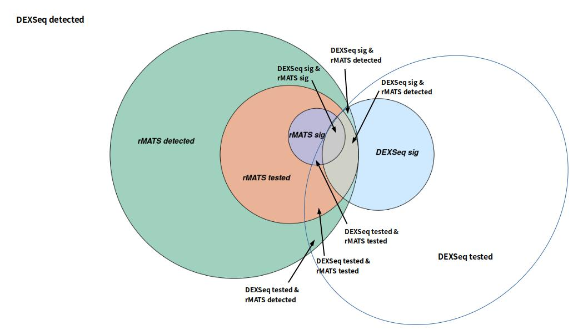

# GrASE
Graph of Alternative Splice junctions and Exonic parts

## About
GrASE is a tool that bridges the gap between the splice-junction approach of software like [rMATS](https://rnaseq-mats.sourceforge.io/index.html) or [MAJIQ](https://majiq.biociphers.org/) and the exon-fragment approach of software like [DEXSeq](https://bioconductor.org/packages/release/bioc/vignettes/DEXSeq/inst/doc/DEXSeq.html). Specifically, this tool uses either rMATS and DEXSeq or MAJIQ and DEXSeq in order to map splicing events to the exons they encompass and vice versa. Before using GrASE, you must run rMATS / MAJIQ on your data in order to get an rmats_output / majiq_output directory, respectively. In addition, you must also run DEXSeq on your data, and then output the results into a txt file. GrASE will use the output of both approach's representative software in order to do its job. 

* Container used for running GrASE can be found here: [GrASE Container](https://drive.google.com/drive/folders/10H6NxN0T1cP0O68VwhCh55KVVb08Iqzb)

## Dependencies  
Tested on Ubuntu (20.04.6 LTS)  

R packages:  
* SplicingGraphs (1.40.0)
* igraph (1.5.1)
* GenomicFeatures (1.52.0)
* AnnotationDbi (1.62.2)
* DEXSeq (1.46.0)

Python packages:  
* python3 (3.11.5)
* rMATS   (4.1.1)
* htseq   (0.13.5)
* igraph  (0.10.6)
* pycairo (1.23.0)
* pandas  (2.1.4)

Other packages:
* STAR   (optional - 2.7.10b)

## DEXSeq and rMATS / MAJIQ
### DEXSeq 
DEXSeq is a software that is used for finding differential exon usage using RNA-seq exon counts between samples with different experimental designs. It conducts statistical tests based on a model that uses the negative binomial distribution to estimate the variance between biological replicates and generalized linear models for testing. The output of DEXSeq is a matrix that has many features including coordinates, pvalue, padj, read counts, and more for every exon described in the GFF file. The GFF is prepared by annotating the GTF of a given dataset. GrASE will use the output of DEXSeq in order to map each exon to a graphML object. This will be compared to rMATS results in order to map DEXSeq exons to rMATS events. 

When running DEXSeq, preprocessing should be done with python to ensure full compatibility. When running `dexseq_prepare_annotation.py`, make sure to include `-r no` as an argument. This will ensure that the dexseq.gff output will be in a non-aggregated form (also to ensure compatibility with GrASE). The rest of the DEXSeq pipeline can be completed as normal. Make sure to create a dexseq_output.txt file when the pipeline is finished. GrASE will use this output file in its analysis. 

### rMATS
rMATS is a computational tool to detect differential alternative splicing events from RNA-Seq data. The statistical model of rMATS calculates the P-value and false discovery rate between two conditions/samples exceeds a given threshold. From the RNA-Seq data, rMATS can automatically detect and analyze Alternative Splicing (AS) Events corresponding to all major types of alternative splicing patterns. For the purposes of GrASE, we will be looking at Alternative 3' and 5' (A3SS/A5SS) Splicing, Retatined Intron (RI) Events, and Skipped Exon (SE) Events. rMATS has many output files. GrASE will use JCEC.*.txt files, one for each of the previously listed AS events. Each of those contain a matrix that have features including coordinates, pvalue, FDR, inclusion and exclusion levels, and more for every AS event that meets rMATS' filtering criteria. GrASE will use the output of rMATS in order to map each event to a graphML object. This will be compared to DEXSeq results in order to map DEXSeq exons to rMATS events.

### MAJIQ
MAJIQ is an annotation and quantitative tool that has a Builder and Quantifier. The Builder uses RNA-Seq BAM files with a transcriptome annotation (GFF3) in order to create graphs of Local Splice Variations (LSV). The Quantifier will compute relative abundance (PSI) of the detected LSVs and changes in PSI (delta PSI) between conditions. This tool is used as an alternative to rMATS for GrASE mapping of alternative splicing events. For the purposes of GrASE, we will be looking at the same events that rMATS detects (A3SS, A5SS, RI, SE), for a relatively direct comparison. GrASE will use the *.deltapsi.tsv file output by the MAJIQ Quantifier to map each event to a graphML object in a similar method to the mapping of rMATS events. This will the be compared to the DEXSeq results in order to map DEXSeq exons to MAJIQ events. 

## Creating graphMLs
GraphML is an XML-based file format for graphs. This step ensures that the coordinates of each gene are annotated and will be essential when creating the splicing graphs. It uses the [SplicingGraphs](https://bioconductor.org/packages/release/bioc/html/SplicingGraphs.html) R package to obtain the splice junctions and exons. 

To generate the GraphML objects for each gene, run [SplicingGraphs.igraph.R](SplicingGraphs.igraph.R). Some command line arguments will be required when you run the R script, including the path to the gtf, the name of the organism associated with the gtf (include genus and species), and the path to the output directory.

Usage:
```
Rscript SplicingGraphs.igraph.R /path/to/gtf Genus species /path/to/output_directory
```
## Preparing to run GrASE
GrASE will process every gene in your dataset that produces results in DEXSeq and rMATS. In order to properly run GrASE, some setup needs to be done. Run [creatingFilesByGene.sh](creatingFilesByGene.sh) to create and set up your `grase_results` directory (created in your current working directory), which will hold everything you need to run GrASE. 

Usage:
```
bash creatingFilesByGene.sh [ -r (if using rMATS) OR -m (if using MAJIQ) ] -s /path/to/splicing/results -d /path/to/dexseq_prepare_annotation.py -a /path/to/annotation/file.gtf -g /path/to/graphml/directory -p number_of_threads
```

This script will create the `grase results` directory, which will contain: 
* `gene_files`, a directory for each relevant gene to be processed in your dataset (taken from rMATS and DEXSeq results)
* `results`, a directory that will hold the final results after running grase.py (next step)

Here is an example of a toy file structure using rMATS for splicing:
```bash
grase_results
├── gene_files
│   ├── ENSG00000286751.1
│   │   ├── ENSG00000286751.1.dexseq.gff
│   │   ├── ENSG00000286751.1.graphml
│   │   ├── ENSG00000286751.1.gtf
│   │   ├── fromGTF.A3SS.txt
│   │   ├── fromGTF.A5SS.txt
│   │   ├── fromGTF.RI.txt
│   │   ├── fromGTF.SE.txt
│   │   └── output
│   ├── ENSG00000287688.1
│   │   ├── ENSG00000287688.1.dexseq.gff
│   │   ├── ENSG00000287688.1.graphml
│   │   ├── ENSG00000287688.1.gtf
│   │   ├── fromGTF.A3SS.txt
│   │   ├── fromGTF.A5SS.txt
│   │   ├── fromGTF.RI.txt
│   │   ├── fromGTF.SE.txt
│   │   └── output
│   └── ENSG00000288597.1
│       ├── ENSG00000288597.1.dexseq.gff
│       ├── ENSG00000288597.1.graphml
│       ├── ENSG00000288597.1.gtf
│       ├── fromGTF.A3SS.txt
│       ├── fromGTF.A5SS.txt
│       ├── fromGTF.RI.txt
│       ├── fromGTF.SE.txt
│       └── output
└── results
    ├── ExonParts
    ├── SplicingEvents
    └── tmp
```

## Running GrASE
Now that the file structure is prepared, grase.py is ready to be ran. This is where the DEXSeq exon and rMATS / MAJIQ event mapping and processing will be done. Each gene in gene_files will be processed, and the output directory of each will be populated with results tables and a graph png of the gene's structure after mapping. 
  
Usage:
```
python3 grase.py -g <gene_files> -s <splicing_software (r for rMATS or m for MAJIQ)> [ --rmats <rmats_results_directory> OR --majiq <majiq_results_directory> ] --dexseq <dexseq_results.txt> --nthread <number_of_threads>
```

Example of an output graph for a simple gene: 


    
## Usage
### All Arguments
```
usage: Rscript SplicingGraphs.igraph.R [options]

options:
 GTF                               An annotation of genes and transcripts in GTF format
 Genus                             Genus of the organism being studied
 species                           Species of the organism being studied
 Output Directory                  The directory where all of the created graphML files
                                   will be placed

usage: bash creatingFilesByGene [options]

options:
 -r rMATS option                   Selecting this optional flag will indicate that
                                   you will be using rMATS results for splicing
 -m MAJIQ option                   Selecting this optional flag will indicate that
                                   you will be using MAJIQ results for splicing
 -s Splicing Directory             The OD directory that holds the final output of
                                   rMATS or MAJIQ
 -d dexseq_prepare_annotation.py   A script that comes as part of the DEXSeq package
 -a GTF                            An annotation of genes and transcripts in GTF format
 -g graphML Directory              The output directory of the SplicingGraphs.igraph.R
                                   script, where graphML objects for each gene are.
 -p NPROCS                         The number of threads. The optimal number of threads
                                    should be equal to the number of cpu cores.

usage: python grase.py [options]

options:
 -h, --help                         Display a help message and exit
 -g Gene Files Directory            The gene_files directory inside grase_results that
                                    was created by creatingFilesByGene.sh
 -s r OR m                          Choosing r or m for this argument will indicate that
                                    you will be using rMATS or MAJIQ results for
                                    splicing, respectively
 --rmats rMATS Results Directory    The OD directory that holds the final output of the
                                    post step of rMATS
 --majiq MAJIQ Results Directory    The OD directory that holds the final output of
                                    MAJIQ (including Builder and Quantifier
 --dexseq Dexseq Results File       The file that holds results from DEXSeq    
 --nthread NTHREAD                  The number of threads. The optimal number of threads
                                    should be equal to the number of cpu cores. Default: 1
```

## Final Output
### Primary Results
* `grase_results/results` contains the final output files from GrASE
    *  `summary.txt`: Final output results table that contains the list of Event and Exon counts based on DEXSeq/rMATS filtering criteria. (Significant is represented by padj values <= 0.05 in DEXSeq and FDR values <= 0.05 in rMATS; Tested is represented by having a padj value in DEXSeq and having an FDR value in rMATS; Detected is represented by having an exon part in the DEXSeq gff file and having an event in the rMATS fromGTF.*.txt files).
    *  `intersections.txt`: Final output table that contains Event and Exon counts for specific intersections only. This can help in understanding what counts will exist in certain sections of a venn diagram, based on the results in `summary.txt`.

        Example Venn Diagram for Exon Counts:  
    *  `DEX_to_(rMATS/MAJIQ)_Events.txt`: Final output that contains DEXSeq results for the dataset with an appended column for rMATS/MAJIQ events that match to each exon part.
    *  `(rMATS/MAJIQ)_to_DEX_Exons.txt`: Final output that contains rMATS/MAJIQ results for the dataset with an appended column for DEXSeq exon parts that match to each event.
    *  `Mapped.ExonsToEvents.txt`: Final output that contains each DEXSeq exon part in the dataset, mapped to each rMATS/MAJIQ event that spans the exon part. Results from both DEXSeq and rMATS/MAJIQ are shown for each row.
    *  `Mapped.EventsToExons.txt`: Final output that contains each rMATS/MAJIQ event in the dataset, mapped to each DEXSeq exon part that spans the event. Results from both rMATS/MAJIQ and DEXSeq are shown for each row.

### Supplementary Results
* `grase_results/results/SplicingEvents` contains the output files that informed our Exon counts in `summary.txt`
    *  `DexSigEvents.txt`: Mapped table that shows each rMATS/MAJIQ event that has at least one significant DEXSeq exon part. A significant DEXSeq exon part with its padj value, as well as the rMATS/MAJIQ event it maps to (with its sig value), is shown for each row.
    *  `DexTestedEvents.txt`: Mapped table that shows each rMATS/MAJIQ event that has at least one tested DEXSeq exon part. A tested DEXSeq exon part with its padj value, as well as the rMATS/MAJIQ event it maps to (with its sig value), is shown for each row.
    *  `(rMATS/MAJIQ)_Sig__DexSigEvents.txt`: Mapped table that shows each significant rMATS/MAJIQ event that has at least one significant DEXSeq exon part. A significant DEXSeq exon part with its padj value, as well as the significant rMATS/MAJIQ event it maps to (with its sig value), is shown for each row.
    *  `(rMATS/MAJIQ)_Sig__DexTestedEvents.txt`: Mapped table that shows each significant rMATS/MAJIQ event that has at least one tested DEXSeq exon part. A tested DEXSeq exon part with its padj value, as well as the significant rMATS/MAJIQ event it maps to (with its sig value), is shown for each row.
    *  `(rMATS/MAJIQ)_SigEvents.txt`: Mapped table that shows each significant rMATS/MAJIQ event. A DEXSeq exon part with its padj value, as well as the significant rMATS/MAJIQ event it maps to (with its sig value), is shown for each row.
    *  `(rMATS/MAJIQ)_Tested__DexSigEvents.txt`: Mapped table that shows each tested rMATS/MAJIQ event that has at least one significant DEXSeq exon part. A significant DEXSeq exon part with its padj value, as well as the tested rMATS/MAJIQ event it maps to (with its sig value), is shown for each row.
    *  `(rMATS/MAJIQ)_Tested__DexTestedEvents.txt`: Mapped table that shows each tested rMATS/MAJIQ event that has at least one tested DEXSeq exon part. A tested DEXSeq exon part with its padj value, as well as the tested rMATS/MAJIQ event it maps to (with its sig value), is shown for each row.
    *  `(rMATS/MAJIQ)_TestedEvents.txt`: Mapped table that shows each tested rMATS/MAJIQ event. A DEXSeq exon part with its padj value, as well as the tested rMATS/MAJIQ event it maps to (with its sig value), is shown for each row.

* `grase_results/results/ExonParts` contains the output files that informed our Events counts in `summary.txt`
    *  `DexSigExons.txt`: Mapped table that shows each significant DEXSeq exon part. An rMATS/MAJIQ event with its sig value, as well as the significant DEXSeq exon part it maps to (with its padj value), is shown for each row.
    *  `DexSig__rMATS_DetectedExons.txt`: Mapped table that shows each significant DEXSeq exon part that has at least one detected rMATS event. An rMATS event with its FDR value, as well as the significant DEXSeq exon part it maps to (with its padj value), is shown for each row.
    *  `DexSig__(rMATS/MAJIQ)_SigExons.txt`: Mapped table that shows each significant DEXSeq exon part that has at least one significant rMATS/MAJIQ event. An rMATS/MAJIQ event with its sig value, as well as the significant DEXSeq exon part it maps to (with its padj value), is shown for each row.
    *  `DexSig__(rMATS/MAJIQ)_TestedExons.txt`: Mapped table that shows each significant DEXSeq exon part that has at least one tested rMATS/MAJIQ event. An rMATS/MAJIQ event with its sig value, as well as the significant DEXSeq exon part it maps to (with its padj value), is shown for each row.
    *  `DexTestedExons.txt`: Mapped table that shows each tested DEXSeq exon part. An rMATS/MAJIQ event with its sig value, as well as the tested DEXSeq exon part it maps to (with its padj value), is shown for each row.
    *  `DexTested__rMATS_DetectedExons.txt`: Mapped table that shows each tested DEXSeq exon part that has at least one detected rMATS event. An rMATS event with its FDR value, as well as the tested DEXSeq exon part it maps to (with its padj value), is shown for each row.
    *  `DexTested__(rMATS/MAJIQ)_SigExons.txt`: Mapped table that shows each tested DEXSeq exon part that has at least one significant rMATS/MAJIQ event. An rMATS/MAJIQ event with its sig value, as well as the tested DEXSeq exon part it maps to (with its padj value), is shown for each row.
    *  `DexTested__(rMATS/MAJIQ)_TestedExons.txt`: Mapped table that shows each tested DEXSeq exon part that has at least one tested rMATS/MAJIQ event. An rMATS/MAJIQ event with its sig value, as well as the tested DEXSeq exon part it maps to (with its padj value), is shown for each row.
    *  `rMATS_DetectedExons.txt`: Mapped table that shows each exon part that is mapped to a detected rMATS event. The rMATS event with its FDR value, as well as a DEXSeq exon part it maps to with its padj value (if applicable), is shown for each row.
    *  `(rMATS/MAJIQ)_SigExons.txt`: Mapped table that shows each exon part that is mapped to a significant rMATS/MAJIQ event. The rMATS/MAJIQ event with its sig value, as well as a DEXSeq exon part it maps to with its padj value (if applicable), is shown for each row.
    *  `(rMATS/MAJIQ)_TestedExons.txt`: Mapped table that shows each exon part that is mapped to a tested rMATS/MAJIQ event. The rMATS/MAJIQ event with its sig value, as well as a DEXSeq exon part it maps to with its padj value (if applicable), is shown for each row.
